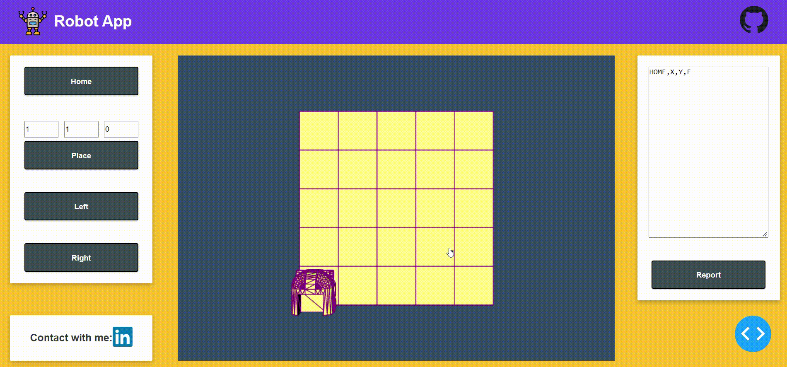

# PythonRobotApp



## Table of contents
* [Installation](#installation)
* [Description](#description)
* [Constraints](#constraints)
* [Test Examples](#test-examples)
* [Deliverables](#deliverables)

## Installation

Install RobotApp-project

Please follow the following steps for local testing:
  
  1. Clone the repo
  
      ```bash
        git clone https://github.com/RomanIlchenko1308/PythonRobotApp.git
        cd PythonRobotApp
      ```
  
  2. Create Virtual Environment with Python
    
      ```bash
        python -m venv venv
      ```
    
  3. Activate Virtual Environment [For Windows]
  
    
      ```bash
        source venv/scripts/activate
      ```
    
  4. Install `requirements.txt`
    
      ```bash
        pip install -r requirements.txt
      ```
  
  5. Run Robot App
      
      ```bash
        python app.py
      ```
      
   6. Open local in browser
   
      ```bash
        http://127.0.0.1:8050/
      ```
      [RobotApp](http://127.0.0.1:8050/)
      
   7. If you use Git Bash, to finish work use combination:

      ```bash
        CTRL + C
      ```

### Description

* The application is a simulation of a toy robot moving on a square tabletop, of dimensions 5 units x 5 units.

* There are no other obstructions on the table surface.

* The robot is free to roam around the surface of the table, but must be prevented from falling to destruction. Any movement that would result in the robot falling from the table must be prevented, however further valid movement commands must still be allowed.

Create an application that can read in commands of the following form:
```
PLACE X,Y,F
MOVE
LEFT
RIGHT
REPORT
```
<!-- ####################################################################### -->
| Commands  | Description of the commands |
| :--------  | -------- |
| ```PLACE```| will put the toy robot on the table in position X,Y and facing NORTH, SOUTH, EAST or WEST. |
| ```MOVE```| will move the toy robot one unit forward in the direction it is currently facing. |
| ```LEFT```<br /> ```RIGHT```| will rotate the robot 90 degrees in the specified direction without changing the position of the robot. |
| ```REPORT```| will announce the X,Y and F of the robot. This can be in any form, but standard output is sufficient. |
<!-- ####################################################################### -->

* The origin (0,0) can be considered to be the SOUTH WEST most corner.

* The first valid command to the robot is a `PLACE` command, after that, any sequence of commands may be issued, in any order, including another `PLACE` command. The application should discard all commands in the sequence until a valid `PLACE` command has been executed

* A robot that is not on the table can choose to ignore the `MOVE`, `LEFT`, `RIGHT` and `REPORT` commands.

* Input can be from a file, or from standard input, as the developer chooses.

* Provide test data to exercise the application.

## Constraints

* The toy robot must not fall off the table during movement. This also includes the initial placement of the toy robot.

* Any move that would cause the robot to fall must be ignored.

### Test Examples:

<!-- ####################################################################### -->
<div >
  <table >

  <!-- ----------------------------------------------------- -->
  <!-- ROW 0 -->
  <tr align="center">
  <td> </td> <td style="width:100%"> Test A </td> <td> Test B </td> <td> Test C </td>
  </tr>

  <!-- ----------------------------------------------------- -->
  <!-- ROW 1 -->
  <tr align="center">

  <td> INPUTS </td>
  <td align="left">

  ```
  PLACE 0,0,NORTH
  MOVE
  REPORT
  ```

  </td>

  <td align="left">


  ```
  PLACE 0,0,NORTH
  LEFT
  REPORT
  ```

  </td>

  <td align="left">


  ```
  PLACE 1,2,EAST
  MOVE
  MOVE
  LEFT
  MOVE
  REPORT
  ```

  </td>

  </tr>

  <!-- ----------------------------------------------------- -->
  <!-- ROW 2 -->
  <tr align="center">

  <td> Expected<br>OUTPUTS </td>

  <td>
  0,1,NORTH
  </td>

  <td>
  0,0,WEST
  </td>

  <td>
  3,3,NORTH
  </td>
  </tr>

  </table>
</div>
<!-- ####################################################################### -->

### Deliverables

Please provide your source code, and any test code/data you using in
developing your solution.

It is not required to provide any graphical output showing the
movement of the toy robot.
